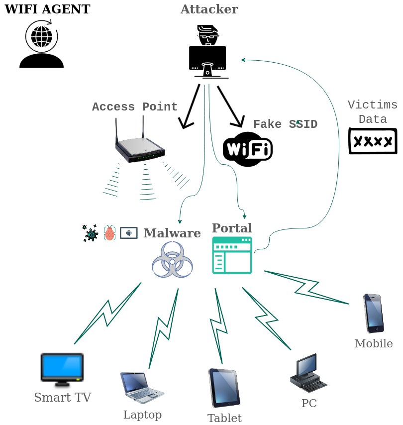
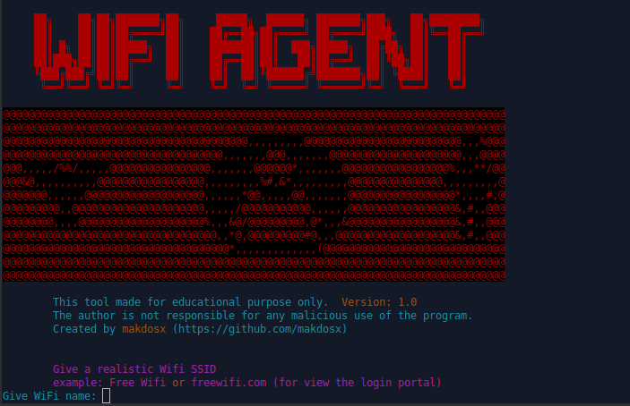
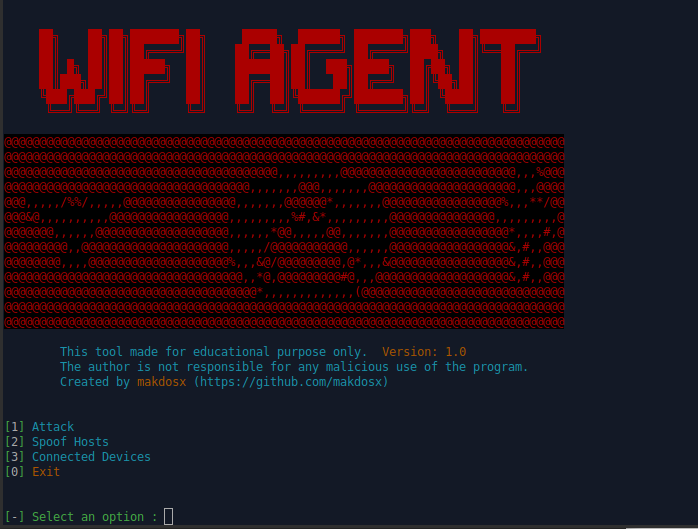
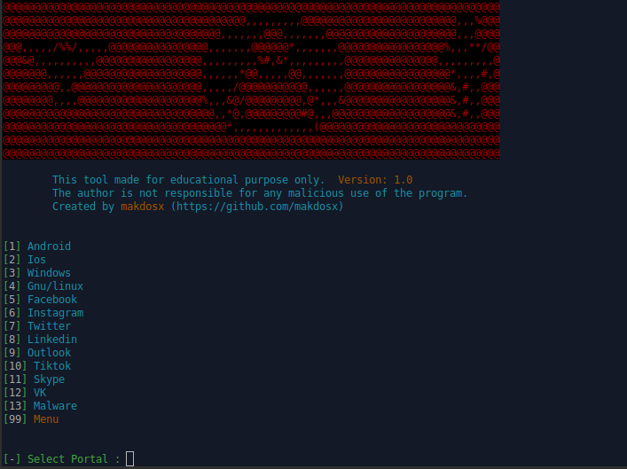

# wifi-agent

 <h1 align="center"> wifi-agent </h1>
 
 <h2 align="center"> Rogue access point. </h2> 
 

<p align="center">
  </br>
</p>


<h3>

The program is made for educational purposes only for to see how the rogue access point method works.
Any unnecessary use of the program is prohibited and the manufacturer has no responsibility for any illegal use by anyone.
Use the tool at your own risk and avoid any sloppy actions.

 </h3>
 
<p>
  
<h4> Installation Instractuions </h4>

Installation on Gnu / Linux OS. </br>

On terminal </br>

```diff
 sudo su 
```

```diff
git clone https://github.com/makdosx/wifi-agent.git 
```
```diff
chmod -R 777 wifi-agent 
```

```diff
cd wifi-agent
```

```diff
bash wifiagent.sh
```

</br> </br>

</p>


<h3>
Feautures and Properties.
</h3>

<p>
Wifi Agent is a modern and advanced cyber security program for computers with Gnu / Linux operating systems and is related to the creation of fake access points and phishing. </br>
It can create captive portal by redirecting users connected to the wireless network to give their credentials for take access to the internet. </br>
It has the ability to forge domain names to redirect the user's requests to the capture portal and also has the ability to insert malware into the capture portal for downloaded by users.
</p>

  </br>

 
 
<br/> <br/> <br/> 

<p>
 
Details

 
1) Phishing and spoofing 

   Attack through automatically cloned services targeting user credentials <br/> 
   and spoofing any domain name for go to captive portal.
  It has 12 ready cloned captive portals, including operating systems login, social networks, e-mails etc. </br>
 



<br/> <br/> <br/> 

 
2) Malware 

  Insert malware on the captive portal. <br/>
  Attack by importing any malware you want so that it can be downloaded by the user.
 
 </br> </br>


 

</p>
